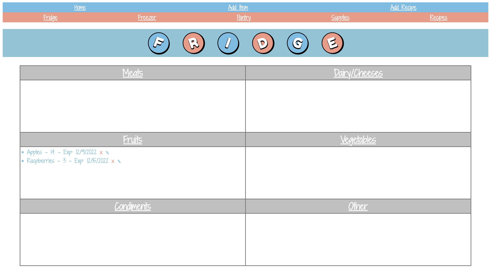
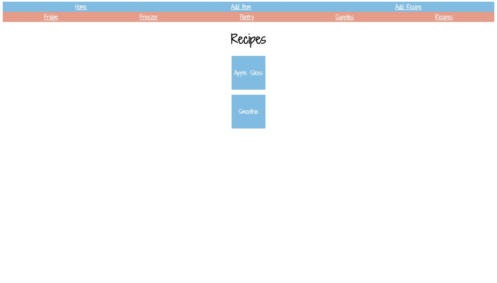
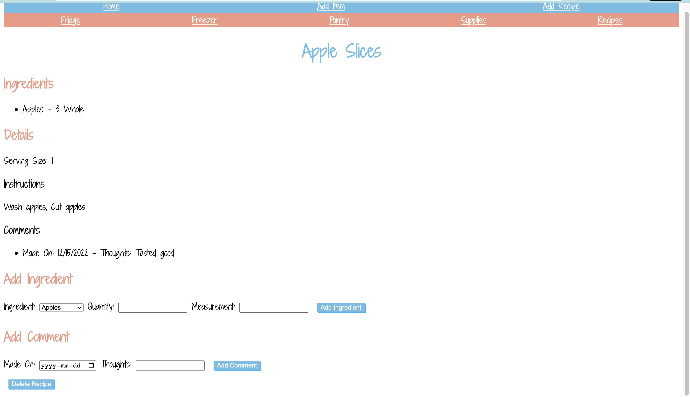
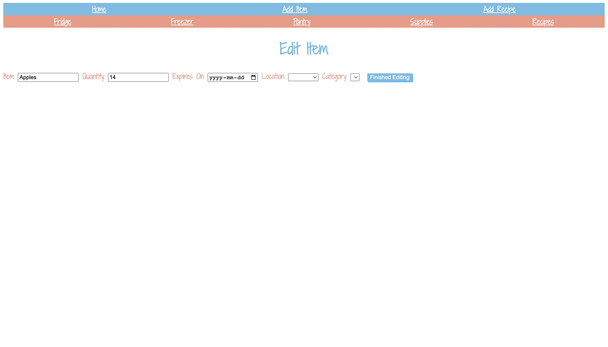

# **KitchenKeeper**  

## General Overview  
Does your food ever go bad because you forgot to eat it? Perhaps it was lost to the abyss at the back of your fridge or your busy schedule flew past the expiry date. With KitchenKeeper, you can now keep track of your groceries and their expiry dates! As a bonus, you can even start tracking new recipes and make comments of any notes or changes for your next attempt.  

The site can be accessed [here](https://kitchenkeeper.up.railway.app/).  

## Screenshots  
Landing Page:  
  
Fridge Page:  
  
Recipes Index Page:  

Recipes Show Page:

Edit Item Page:

## Technologies Used  
- HTML
- CSS
- JavaScript
- Express.js
- Node.js
- Mongoose
- MongoDB

## Future Work  
- **Add edit feature to Recipe Comments and Ingredients**  
Unfortunately, I was unable to get this feature working in the current timeframe. This feature would help improve UI.  
- **Continue with more styling with eventual customization**  
I originally hoped to have a clickable kitchen scene on the landing page. I would also like to fix some of the formatting on the forms.  
- **Foods close to expiry and items at low/no stock to show on the landing page**  
These features would help improve UI and prevent food expiration or item run-out.  
- **OAuth inclusion**  
This would allow anyone to use the app to track their own household foods and items.
